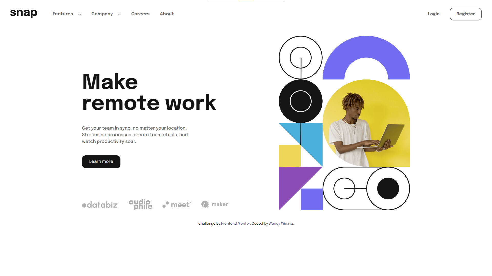

# Frontend Mentor - Intro section with dropdown navigation

This is a solution to the [Intro section with dropdown navigation challenge on Frontend Mentor](https://www.frontendmentor.io/challenges/intro-section-with-dropdown-navigation-ryaPetHE5). Frontend Mentor challenges help you improve your coding skills by building realistic projects. 

## Table of contents

- [Overview](#overview)
  - [The challenge](#the-challenge)
  - [Screenshot](#screenshot)
  - [Links](#links)
- [My process](#my-process)
  - [Built with](#built-with)
- [Author](#author)

**Note: Delete this note and update the table of contents based on what sections you keep.**

## Overview

### The challenge

Users should be able to:

- View the optimal layout depending on their device's screen size
- See hover and focus states for interactive elements

### Screenshot

### Links

- Solution URL: [Github Repo](https://github.com/wendywinata128/Front-End-Mentor_Intro-Section-Nav-Dropdown)
- Live Site URL: [Github Pages](https://wendywinata128.github.io/Front-End-Mentor_Intro-Section-Nav-Dropdown/)

## My process

### Built with

- Semantic HTML5 markup
- CSS custom properties
- Flexbox

## Author

- Website - [Wendy Winata](https://www.devprofile.me/wendy)
- LinkedIn - [Wendy Winata](https://www.linkedin.com/in/wendyyy/)

